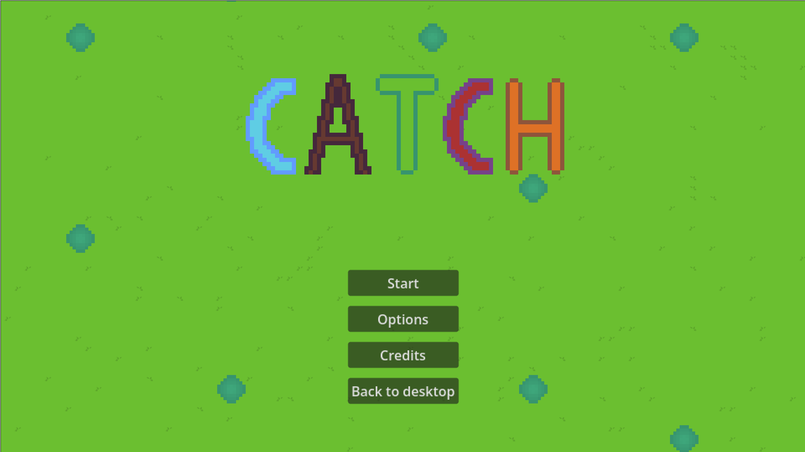

Ein kleines 2D-Pixelart-Game zur Übung von Konzepten wie Pathfinding, Dialog- und Decision-Trees. Zudem dient es der generellen Kombination erlernter Spieleelemente (wie Menüs, Musikwiedergabe, Player-Movement etc.), um diese gemeinsam in einem Projekt anzuwenden, anstatt sie separat als reine Demos zu erstellen.

Das Grundkonzept war ein Cozy-Game mit Fokus auf Dialogen

Angewandte Skills: 
- Grundlegende Programmierfähigkeiten
- Erstellung von Pixelart-Assets via Aseprite
- schnelle Auffassungsgabe während des Entwicklungsprozesses und direkte Anwendung des Gelernten (z. B. durch Refactoring und Code-Optimierung)
- Verwendung von Git und GitHub
- Projektmanagement via Notion
- Godot Engine mit Plug-In (Dialog Manager 3)

Stärken / Gelungene Aspekte:
- Menü: Passt thematisch sehr gut zum Spiel

- Audio: Stimmige Kombination eigener Assets mit lizenzfreien Assets (Musik).
- Engine-Elemente: Pathfinding gut implementiert, 

- Viele neue Fähigkeiten erlernt, wie die Relevanz von genauen Fehler Meldungen selbst bei kleinen Projekten, Implementierung von Pathfinding, arbeiten mit Plug-ins, Anschaffung von Assets und besseres Verständnis von Lizenzarten usw..

Schwächen / Ausbaufähige Aspekte:
- Bisher fehlen externe Playtests, um das Gameplay und den Spielspaß objektiv zu bewerten.
- Das Projekt befindet sich aktuell noch im Demo-Status.
- Es gibt noch kein ausgereiftes Leveldesign.
- Die Story muss noch weiter ausgearbeitet und angepasst werden.

Entstandene Hürden & Herausforderungen:
- Scope Creep: Ich wollte immer mehr Features einbauen, während andere Elemente noch in Arbeit waren.
- Code-Refactoring: Meine wachsenden Fähigkeiten während der Entwicklung machten es nötig, zuvor geschriebenen Code anzupassen oder komplett zu überarbeiten. Beispiel: Meine Herangehensweise an die „Cats“. Zunächst wurden 5 verschiedene Objekte mit jeweiligen Sprites erstellt. Später wurde dies zu einem einzigen Objekt optimiert, welches die Sprites abhängig von einer Variable lädt. Das machte das System deutlich skalierbarer und zukünftige Anpassungen weniger zeitintensiv.
- Story: Aktuell behandelt sie Themen wie „Found Family“ und Verlustängste. Sie ist jedoch noch nicht fertig und muss thematisch überarbeitet werden. Es stellt sich zudem die Frage, ob diese ernsten Themen gut zum Artstyle und dem anfänglichen Grundkonzept passen.
- Fehlendes Zeitmanagement: Grundsätzlich führte das Fehlen einer festen Deadline dazu, dass das Kernkonzept immer wieder geändert wurde, anstatt dem ursprünglichen Plan konsequent zu folgen und diesen optimal umzusetzen.

Copyright (c) 2026 Julius Wiest. All rights reserved.
Der Quellcode in diesem Repository dient nur zur Ansicht. Jegliche Nutzung, Vervielfältigung, Veränderung oder Verbreitung des Codes – auch in Teilen – ist ohne ausdrückliche schriftliche Genehmigung strikt untersagt.
